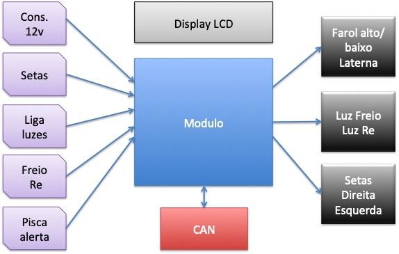
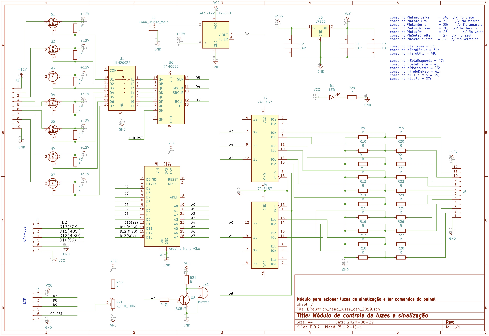
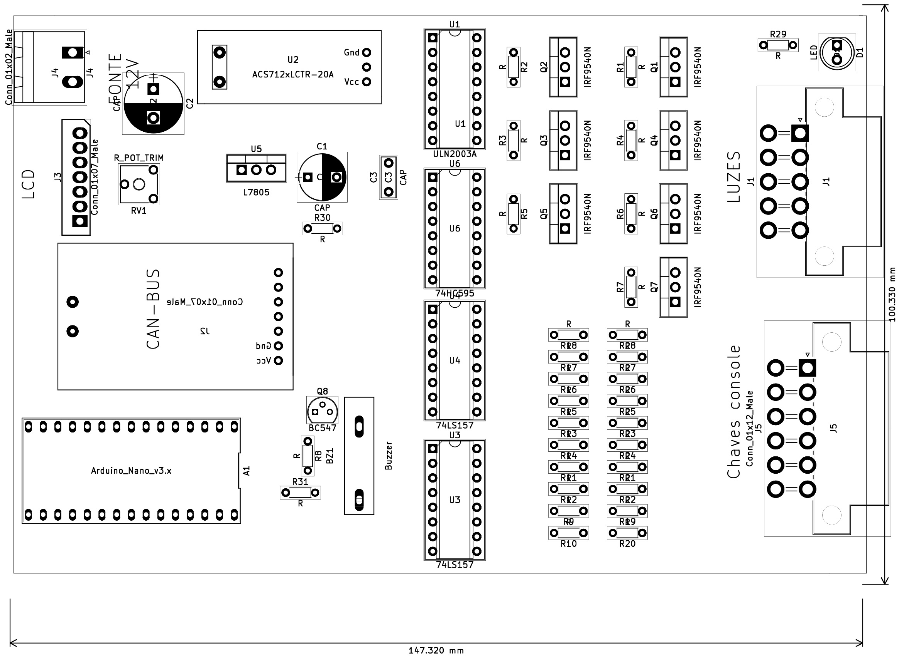
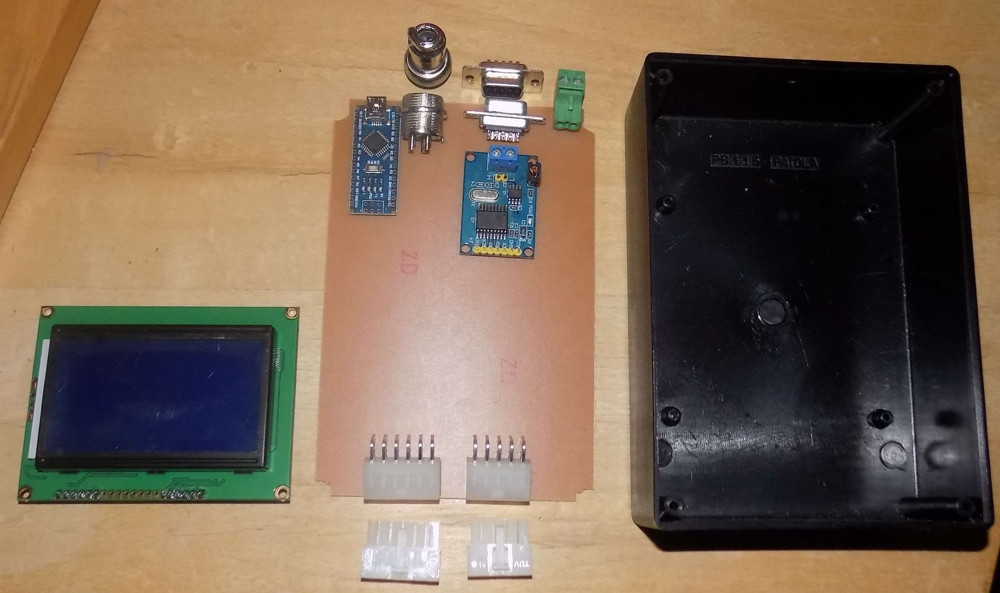
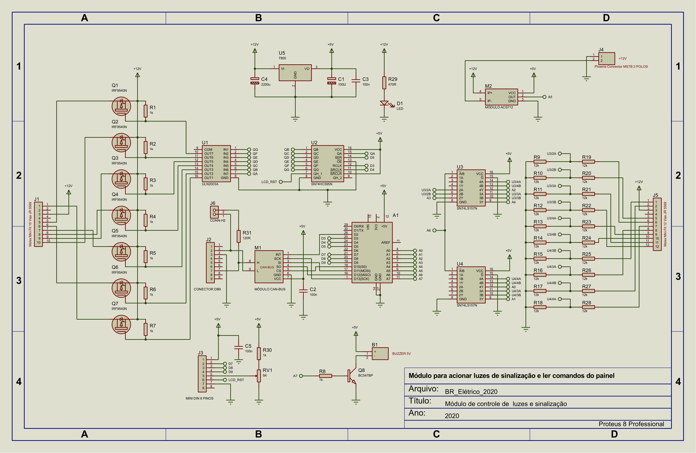
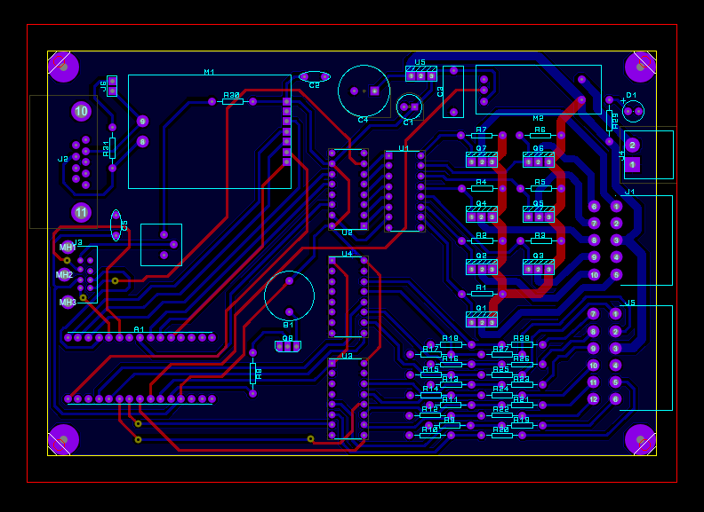
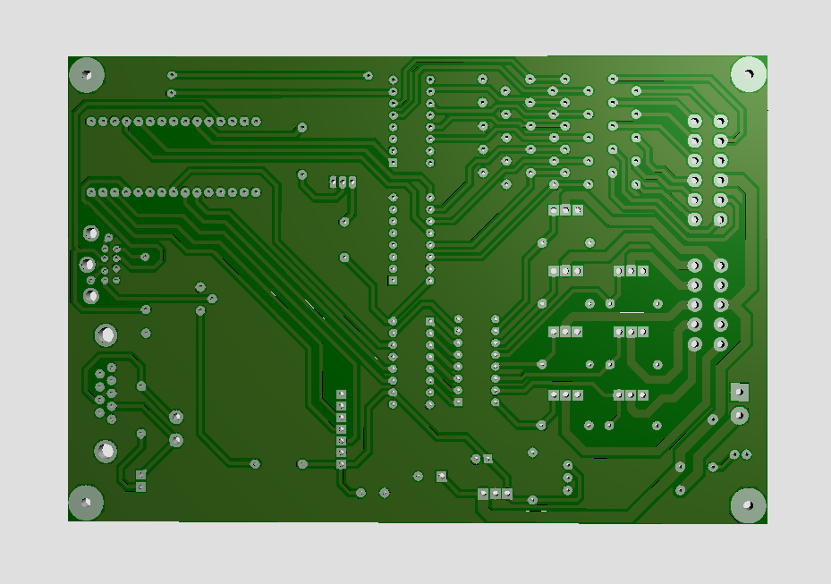
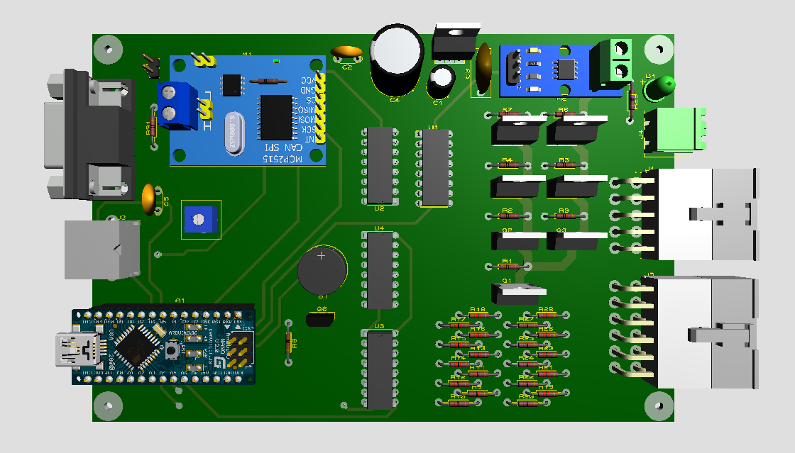
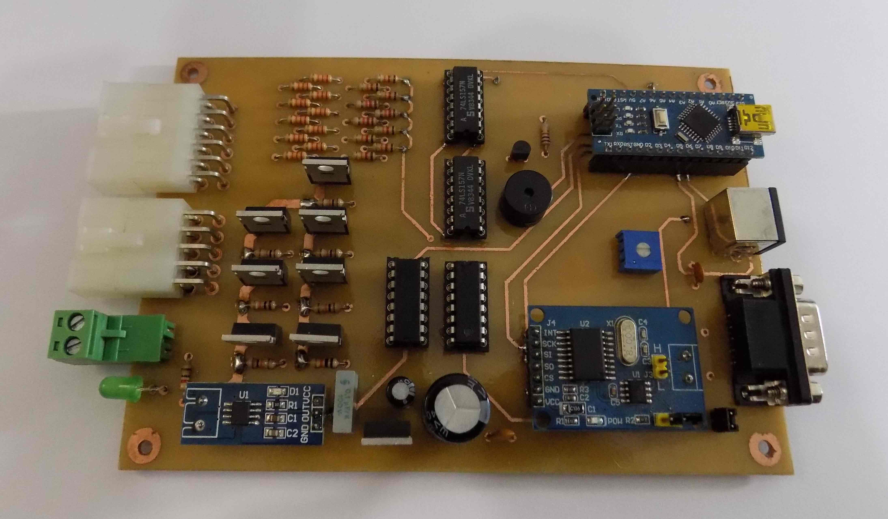

# Módulos de de controle de luzes e sinalização

`Documentos\GitHub\Modulo-luzes`

# 1. Hardware
 
A Van é um veículo fabricado há 10 anos com um sistema de controle de luzes e sinalização convencional baseado em relés e interruptores simples. A conversão da Van para elétrico, também teve que fazer o *redesing* das instalações elétricas do veículo, incorporando toda sinalização e comando de luzes à barramento de comunicação do novo veículo.

Usou-se como base o módulo desenvolvido para o BR800. Este novo módulo foi desenhado para centralizar todos os comandos de luzes e sinalização, aproveitando as teclas e interruptores já existentes no *dashboard* do veículo, mas permitido a sua expansão com elementos não convencionais que podem ser facilmente incorporado na nova configuração tecnológica. O diagrama de blocos a seguir mostra o esquema funcional do novo módulo.

   

Este módulo tem como elemento central o Arduino Nano. Escolheu-se esta placa microcontroladora por sua popularidade, grande acervo técnico de suporte e relação custo benefício. 
O módulo monitora as teclas no painel para ligar a sinalização (setas direita e esquera), farois (baixo e alto), lanterna, luz de freio, pisca alerta, freio de mão, e luz de ré no total de 9 comandos.

Estes comandos são processados pelo módulo e apresentado de forma gráfico no display do módulo e por meio de 7 comandos os sinais luminosos farol alto, farol baixa, lanterna, luz de freio, luz de ré e as setas para direita e esquerda são acionados. 
A sinalização de freio de mão acionada é somente encaminhada para o display. 
O módulo também emite o sinal sonoro de alarme ou setas, por meio de um buzzer. 
As figuras a seguir mostram o esquema elétrica do módulo e a placa de circuito impresso. 

O módulo tem a capacidade de monitorar seu consumo de corrente e a sua tensão e o barramento CAN permitirá a medição e acionamento remoto.
A comunicação CAN é implementado por um controlador dedicada para CAN Bus MCP2515 que está ligado por meio da interface SPI ao microcontrolador Arduino. Veja o datasheet do controlador MCP2515 
[aqui](http://ww1.microchip.com/downloads/en/DeviceDoc/MCP2515-Stand-Alone-CAN-Controller-with-SPI-20001801J.pdf). 

Os demais componentes do módulo são todos circuitos integrados convencionais, com destaque para o sensor de corrente ACS712.
O layout da placa de circuito impresso (PCB) está na figura a seguir. 

## 1.1. Alojamento e conexões

O módulo será alojado numa caixa padrão Patola [PB115](http://www.patola.com.br/index.php?route=product/product&product_id=359) com conectores específicos para cada funcionalidade, com pinagem diferenciados para evitar trocas. Os conectores para display, alimentação 12 volts, CAN também são padronizadas. 
Convencionou-se que entrada dos sensores e saída dos comandos ficarão na parte de traseira da caixa, enquanto a interface CAN, alimentação, saída para display e acesso para reporgramação do arduino ficarão no frente. A interface CAN será implementado por dois conectores DB9, mantendo o padrão industrial.

A foto na figura a seguir mostra a caixa PB115 com a proposta de placa de circuito impresso com na parte de frente os conectores de entrada dos botões e saída para as lámpadas. Na parte de traz, entrada para programar o arduino nano, o conector para o dislay, interface CAN e alimentação de 12Vdc.     

## 1.2. Protótipo V1
Primeiro protótipo montado em setembro 2020.

## 1.3. Conector CAN

Pinagem do conector DB9 macho para ligar o barramento CAN.

| pino | função       | 
|:----:|:------------:|
| 1 | | 
| 2 | |

## 1.3. Conector LCD 

Pinagem do conector mini DIN femea para ligar o LCD.

| pino | função       | 
|:----:|:------------:|
| 1 | | 
| 2 | |

## 1.4 Comando de Luzes

O conector de comando de luzes é formado por um conector de 2x5 pinos (modelo - tipo) com a seguinte especificação.
Na primeira fileira os pinos:

| pino | função       | cor      | ULN   | 74595 |
|:----:|:------------:|:--------:|:-----:|:-----:|
| 1    | Luz de freio | cinza    | Out 1 |  QG   |
| 2    |  GND         | preto    | GND   |  -    |
| 3    |  12V         | vermelho | 12V   |  -    |
| 4    |  GND         | preto    | GND   |  -    |
| 5    | Luz de ré    | branco   | Out 7 |  QA   |

Na segunda fileira os pinos: 

| pino | função        | cor     |  ULN  | 74595 | 
|:----:|:-------------:|:-------:|:-----:|:-----:|
| 6    | Lanterna      | laranja | Out 2 | QF    |
| 7    | Farol baixa   | amarela | Out 3 | QE    |
| 8    | Farol alta    | verde   | Out 4 | QD    |
| 9    | Seta direita  | azul    | Out 5 | QC    |
| 10   | Seta esquerda | violeta | Out 6 | QB    |

Os pinos D3, D4 e D5 comandam o 74HC595 

| pino | nome  | 74595 |pino função             |
|:----:|:-----:|:-----:|:-----------------------| 
| D3   | RCLK  | 12    | Storage register clock |
| D4   | SRCLK | 11    | Shift register clock   |
| D5   | SER   | 14    | serial data input      | 

## 1.5 Entrada de Comando

| pino | função |
|:----:|:-----:|
| 1 | | 
| 2 | | 

# 2. Programa 

Repositório local

`Arduino\BReletrica\BREletrica_Luzes_CAN_beep_display_2020_11_22` 

O programa de controle está no repositório remoto 
[`https://github.com/rudivels/BREletrica_Luzes_CAN_beep_display`](https://github.com/rudivels/BREletrica_Luzes_CAN_beep_display)

O programa usa a biblioteca do Sparkfun que implementa as funcionalidades do MCP2551 que implementa as camadas física e enlace.

# 3. CANOPEN ou J1939

Apresentar aqui o uso do CANOPEN ou J1939 que vamos usar para implementar as camadas de rede e superior.

Mostrar que CANOPEN e J1939 trabalham nas mesmas camadas, mas que CANOPEN é mais abrangente que SAE J1939 pois envolve todo tipo de rede de controle e automação, enquanto J1939 foi desenvolvido para aplicação em veiculos de industriais. 

Mostrar que este padrão surgiu num mercado restrito para máquinas veículos industriais, que diferentemente dos fabricantes convencionais de veículos de linha de montagem, tinham necessidades de interoperabilidade e conexão com outros fabricantes.  

Mostrar que isso será uma tendência em carros elétricos, ou carros convertidos.

[`https://www.csselectronics.com/screen/page/simple-intro-j1939-explained`](https://www.csselectronics.com/screen/page/simple-intro-j1939-explained)

[`https://www.youtube.com/watch?v=DlbkWryzJqg&feature=emb_rel_end`](https://www.youtube.com/watch?v=DlbkWryzJqg&feature=emb_rel_end)

# 3.1. Máquina de estado do J1939