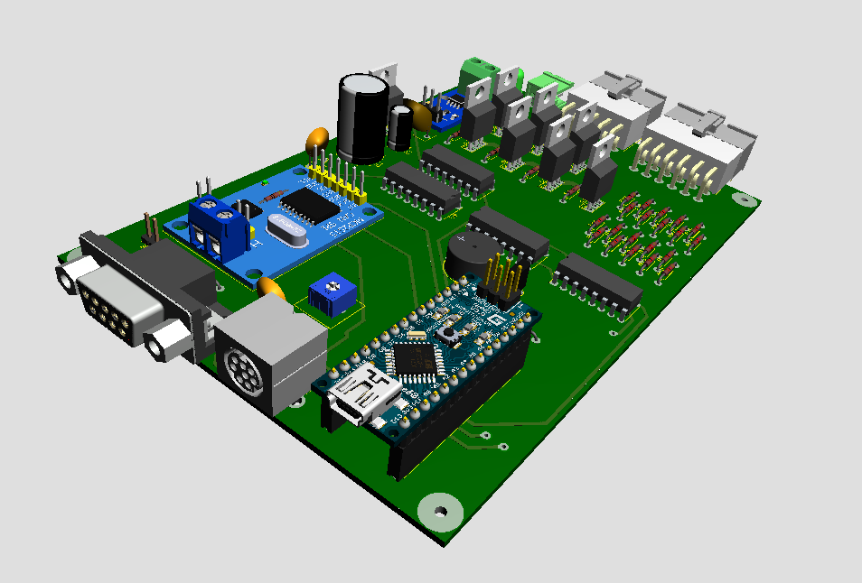

# Módulos de de controle de luzes e sinalização

`Documentos\GitHub\Modulo-luzes`

# 1. Hardware
 
A Van é um veículo fabricado há 10 anos com um sistema de controle de luzes e sinalização convencional baseado em relés e interruptores simples. A conversão da Van para elétrico, também teve que fazer o *redesing* das instalações elétricas do veículo, incorporando toda sinalização e comando de luzes à barramento de comunicação do novo veículo.

Usou-se como base o módulo desenvolvido para o BR800. Este novo módulo foi desenhado para centralizar todos os comandos de luzes e sinalização, aproveitando as teclas e interruptores já existentes no *dashboard* do veículo, mas permitido a sua expansão com elementos não convencionais que podem ser facilmente incorporado na nova configuração tecnológica. O diagrama de blocos a seguir mostra o esquema funcional do novo módulo.

   

Este módulo tem como elemento central o Arduino Nano. Escolheu-se esta placa microcontroladora por sua popularidade, grande acervo técnico de suporte e relação custo benefício. 
O módulo monitora as teclas no painel para ligar a sinalização (setas direita e esquera), farois (baixo e alto), lanterna, luz de freio, pisca alerta, freio de mão, e luz de ré no total de 9 comandos.

Estes comandos são processados pelo módulo e apresentado de forma gráfico no display do módulo e por meio de 7 comandos os sinais luminosos farol alto, farol baixa, lanterna, luz de freio, luz de ré e as setas para direita e esquerda são acionados. 
A sinalização de freio de mão acionada é somente encaminhada para o display. 
O módulo também emite o sinal sonoro de alarme ou setas, por meio de um buzzer. 
As figuras a seguir mostram o esquema elétrica do módulo e a placa de circuito impresso. 

O módulo tem a capacidade de monitorar seu consumo de corrente e a sua tensão e o barramento CAN permitirá a medição e acionamento remoto.
A comunicação CAN é implementado por um controlador dedicada para CAN Bus MCP2515 que está ligado por meio da interface SPI ao microcontrolador Arduino. Veja o datasheet do controlador MCP2515 
[aqui](http://ww1.microchip.com/downloads/en/DeviceDoc/MCP2515-Stand-Alone-CAN-Controller-with-SPI-20001801J.pdf). 

Os demais componentes do módulo são todos circuitos integrados convencionais, com destaque para o sensor de corrente ACS712.
O layout da placa de circuito impresso (PCB) está na figura a seguir. 

## 1.1. Alojamento e conexões

O módulo será alojado numa caixa padrão Patola [PB115](http://www.patola.com.br/index.php?route=product/product&product_id=359) com conectores específicos para cada funcionalidade, com pinagem diferenciados para evitar trocas. Os conectores para display, alimentação 12 volts, CAN também são padronizadas. 
Convencionou-se que entrada dos sensores e saída dos comandos ficarão na parte de traseira da caixa, enquanto a interface CAN, alimentação, saída para display e acesso para reporgramação do arduino ficarão no frente. A interface CAN será implementado por dois conectores DB9, mantendo o padrão industrial.

A foto na figura a seguir mostra a caixa PB115 com a proposta de placa de circuito impresso com na parte de frente os conectores de entrada dos botões e saída para as lámpadas. Na parte de traz, entrada para programar o arduino nano, o conector para o dislay, interface CAN e alimentação de 12Vdc.     

## 1.2. Protótipo V1
Primeiro protótipo montado em setembro 2020.

## 1.3. Conector CAN

Pinagem do conector DB9 macho para ligar o barramento CAN.

| pino | função  | 
|:----:|:-------:|
| 2    | CAN-L   | 
| 7    | CAN-H   |
| 3    | GND     |
| 9    | 12V     |

## 1.3. Conector LCD 

Pinagem do conector mini DIN femea para ligar o LCD.

| mini Din | função LCD | Origem  |
|:--------:|:--------:|:-------:|
|   | RS     | D7 Arduino |
|   | RW     | D8 Arduino |
|   | Enable | D9 Arduino| 
|   | Reset  | QH1 do 74HC595  |
|   | Vcc    | Vcc  do Arduino | 
|   | GND    | Fomte   | 
|   | Vo     | Trimpot |

O beep foi implememtado com o pino D6 do Arduino com um sinal PWM.

`analogWrite(beep, 100);` 

## 1.4 Comando de Luzes

O conector de comando de luzes é formado por um conector de 2x5 pinos (modelo - tipo) com a seguinte especificação.
Na primeira fileira os pinos:

| pino | função       | cor      | ULN   | 74595 |
|:----:|:------------:|:--------:|:-----:|:-----:|
| 1    | Luz de freio | cinza    | Out 1 |  QG   |
| 2    |  GND         | preto    | GND   |  -    |
| 3    |  12V         | vermelho | 12V   |  -    |
| 4    |  GND         | preto    | GND   |  -    |
| 5    | Luz de ré    | branco   | Out 7 |  QA   |

Na segunda fileira os pinos: 

| pino | função        | cor     |  ULN  | 74595 | 
|:----:|:-------------:|:-------:|:-----:|:-----:|
| 6    | Lanterna      | laranja | Out 2 | QF    |
| 7    | Farol baixa   | amarela | Out 3 | QE    |
| 8    | Farol alta    | verde   | Out 4 | QD    |
| 9    | Seta direita  | azul    | Out 5 | QC    |
| 10   | Seta esquerda | violeta | Out 6 | QB    |

Os pinos D3, D4 e D5 comandam o 74HC595 

| pino | nome  | 74595 |pino função             |
|:----:|:-----:|:-----:|:-----------------------| 
| D3   | RCLK  | 12    | Storage register clock |
| D4   | SRCLK | 11    | Shift register clock   |
| D5   | SER   | 14    | serial data input      | 

## 1.5 Entrada de Comando

| pino | função |
|:----:|:-----:|
|  | FarolBaixo  |
|  | FarolAlto   |
|  | SetaEsquerda |
|  | SetaDireita |
|  | PiscaAlerta |
|  | FreioDeMao  |
|  | LuzDeFreio  |
|  | LuzRe       |

# 2. Implementação da programação  

O programa implementado está no repositório local

`Arduino/BReletrica/BREletrica_Luzes_CAN_beep_display_2020_11_22` 

e no  repositório remoto 
[`https://github.com/rudivels/BREletrica_Luzes_CAN_beep_display`](https://github.com/rudivels/BREletrica_Luzes_CAN_beep_display)

O programa usa a biblioteca do Sparkfun que implementa as funcionalidades do MCP2551 que implementa as camadas física e enlace.

A programação do modulo de luzes pode ser dividido em rotina de controle de sinalização, rotina de monitoramento de potência e consumo, rotina de mostar os dados no paiel, comunicação CAN que rodam parelela no Arduino.

Os requisitos do tempo de atualização dos variaveis foram obtidas da documentação do Protocolo J1939, que define esses tempos para a maioria das variáveis.

## 2.1. Rotina de controle de sinalização 
A rotina de sinalização monitora as diversas chaves e botões no painel do veículo e comando as saídas de luzes e sinal sonoro respectivamente.
São ao total 8 entradas 7 saídas de lampadas, além de um sinal sonoro (beep). 

Não há um valor mínima definida para taxa de amostragem, mas procura-se manter o tempo na ordem de meio segundo ou menor. 

Além disso, a rotina disponibilizará os seguintes dados para comunicação via CAN

Não há muita documentação disponível para a implementação do J1939, mas vamos definir que o modulo de luzes deve disponibilizar no barramento CAN a cada segunda os dados do seu estado de funcionamento. 

O tempo de 1 segundo é compatível com alguns padrões J1939 pesquisadas. 
O Parametro Group Number do  grupo de mesnagens de módulo chave seta em alguns documentos é definido como PGN 655535 ou 0xFFFF e manda um bloco de dados de 24 bytes a cada 1000 ms. 
Não tem nenhuma padronização da mensagem e pelo visto cada fabricante implementa o seu

## 2.2. Rotina para mostrar dados no painel 

A rotina para mostrar os dados no LCD no paiel é praticamente a mesma rotina de sinalização. Ela tem as mesmas entradas e a diferença é que as saídas são no display.

A atualização dos dados é no mínimo a uma frequencia de 3Hz.

Os dados do monitoramento de potêcia e consumo não serão mostrados no painel para não sobrecarregar a visualização dos dados.

## 2.3. Monitoramento de potência e consumo
A rotina de medição de potência e consumo avalia a cada segundo a tensão e a corrente elétrica consumida pelo módulo.

As entradas são:

- tensão 12 v (analógica), 1 byte, 0-20V
- corrente 12v (analógica), 1 byte, 0 - 5 Amp

As saídas da rotina são as mesmas das entradas acrescidas de

- potência 12v (analógica), 1 byte , 0-100W
- Consumo acumulada, 2 bytes, 0 - 1000kWh
- Alarme tensão baixa 12v, bit

Os dados de entrada e sáida também vão ser disponibilizados no barramento CAN a uma taxa de 1000 ms.

Ainda não se descobriu um PGN que já tem algum padrão para este tipo de dados.  

## 2.4. Comunicação CAN J1939

A rotina de comunicação J1939 deve implementar dos PGNs que devem mandar as mensagem a cada 1000 ms. 

Ainda não há uma definição se o módulo vai receber alguma informação ou algum comando do barramento CAN. 

A principio não ha necessidade de receber dados dos demais subsistemas.

- PGN 65355 ou 0xFFFF  (modulo chave seta)
- PGN ?????  monitoramento tensão, corrente,potência e consumo

# 3. Protocolo CANOPEN para Tecnomobele

# Bibliografia 
Veja o trabalho de Borth, T. F. (2016). Analisando os Impactos do Uso do Protocolo Can FD em Aplicaçõees Automotivas – Estudo de Caso. Dissertação de mestrado em engenharia eléetrica, Universidade Federal do Rio Grande do Sul. (páginda 67) 
